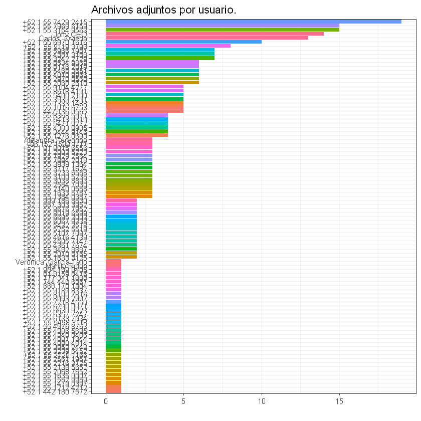

# Análisis de texto de un chat de WhatsApp

Este análisis se realiza para obtener información de acerca de la conversación y de sus participantes.
<br>Análisis por: Jorge Roberto Ahumada.

## Preparación del ambiente de trabajo
Carga e instalación de librerías y datos.
* Tidyverse: Librería para la limpieza y trabajo de datos que se compone de múltiples otras librerías, es una colección de paquetes para R.
* Rwhatsapp: Librería para el estudio de conversaciones de WhatsApp
* Wordcloud: Librería que permite formar nubes de palabras para entender de manera visual el uso de las palabras dentro del dataset.
* Stringr: Librería que facilita el trabajo y limpieza de strings.
* TM: Framework para minería de datos. 
* data.table: Librería para manejar con facilidad data sets en formato de tabla.
* Lubridate: Librería que simplifica el manejo de fechas.
* Emoji font: Paquete que permite la visualización de emoji dentro de R, principalmente en gráficas.
* Tidytext: Análisis y extracción de textos con base en el paquete dplyr.
* Stopwords: palabras que se repiten en varias ocasiones y que no afectan el contexto ni significado del mensaje.


```R
#devtools::install_github("JBGruber/rwhatsapp")
library(tidyverse) 
library(rwhatsapp, lib="C:/R")
library(wordcloud)
library(stringr)
library(tm)
library(data.table)
library(lubridate)
library(emojifont)
library(tidytext)
library(stopwords)
```

    Warning message:
    "package 'emojifont' was built under R version 3.5.3"


    Error: package or namespace load failed for 'emojifont':
     .onLoad failed in loadNamespace() for 'sysfonts', details:
      call: font_add("sans", sans.r, sans.b, sans.i, sans.bi, NULL)
      error: freetype: cannot open resource, error code 1
    Traceback:
    

    1. library(emojifont)

    2. tryCatch({
     .     attr(package, "LibPath") <- which.lib.loc
     .     ns <- loadNamespace(package, lib.loc)
     .     env <- attachNamespace(ns, pos = pos, deps)
     . }, error = function(e) {
     .     P <- if (!is.null(cc <- conditionCall(e))) 
     .         paste(" in", deparse(cc)[1L])
     .     else ""
     .     msg <- gettextf("package or namespace load failed for %s%s:\n %s", 
     .         sQuote(package), P, conditionMessage(e))
     .     if (logical.return) 
     .         message(paste("Error:", msg), domain = NA)
     .     else stop(msg, call. = FALSE, domain = NA)
     . })

    3. tryCatchList(expr, classes, parentenv, handlers)

    4. tryCatchOne(expr, names, parentenv, handlers[[1L]])

    5. value[[3L]](cond)

    6. stop(msg, call. = FALSE, domain = NA)


```R
base <- rwa_read("C:/DataScience08012019/whatsapp/data/chatWA.txt")
head(base)
```


<table>
<thead><tr><th scope=col>time</th><th scope=col>author</th><th scope=col>text</th><th scope=col>emoji</th><th scope=col>emoji_name</th></tr></thead>
<tbody>
	<tr><td>2019-03-14 13:56:16                                                                                                                                                                                                                                                                                                                                  </td><td><span style=white-space:pre-wrap>Networking BTL &amp; Mkt              </span>                                                                                                                                                                                                                                                                       </td><td><span style=white-space:pre-wrap>&lt;U+200E&gt;Los mensajes en este grupo ahora están protegidos con cifrado de extremo a extremo.                                                                                                                                                                                                            </span></td><td>                                                                                                                                                                                                                                                                                                                                                     </td><td>                                                                                                                                                                                                                                                                                                                                                     </td></tr>
	<tr><td>2019-03-14 13:56:16                                                                                                                                                                                                                                                                                                                                              </td><td><span style=white-space:pre-wrap>NA                                </span>                                                                                                                                                                                                                                                                                       </td><td><span style=white-space:pre-wrap>&lt;U+200E&gt;&lt;U+202A&gt;+52 1 55 3100 5236&lt;U+202C&gt; creó este grupo                                                                                                                                                                                                                                             </span></td><td>                                                                                                                                                                                                                                                                                                                                                                 </td><td>                                                                                                                                                                                                                                                                                                                                                                 </td></tr>
	<tr><td>2019-03-14 14:15:31                                                                                                                                                                                                                                                                                                                                              </td><td><span style=white-space:pre-wrap>NA                                </span>                                                                                                                                                                                                                                                                                       </td><td><span style=white-space:pre-wrap>&lt;U+200E&gt;&lt;U+202A&gt;+52 1 55 3100 5236&lt;U+202C&gt; te añadió                                                                                                                                                                                                                                                   </span></td><td>                                                                                                                                                                                                                                                                                                                                                                 </td><td>                                                                                                                                                                                                                                                                                                                                                                 </td></tr>
	<tr><td>2019-03-14 14:16:43                                                                                                                                                                                                                                                                                                                            </td><td>&lt;U+202A&gt;+52 1 55 1333 1488&lt;U+202C&gt;                                                                                                                                                                                                                                                                                                 </td><td><span style=white-space:pre-wrap>Hola a todos y gracias Giovana. Soy Lizeth Guerrero,  actualmente estamos en búsqueda en la agencia de un Campaign Specialist de Google Ads, alguien que opere algunos de nuestros clientes y optimice campañas,  si saben de alguien porfa avisenme, gracias                                          </span></td><td>                                                                                                                                                                                                                                                                                                                                               </td><td>                                                                                                                                                                                                                                                                                                                                               </td></tr>
	<tr><td>2019-03-14 14:19:25                                                                                                                                                                                                                                                                                                                                                          </td><td><span style=white-space:pre-wrap>NA                                </span>                                                                                                                                                                                                                                                                                                   </td><td><span style=white-space:pre-wrap>&lt;U+200E&gt;&lt;U+202A&gt;+52 1 55 3100 5236&lt;U+202C&gt; añadió a &lt;U+202A&gt;+52 1 55 5075 7577&lt;U+202C&gt;                                                                                                                                                                                                                 </span></td><td>                                                                                                                                                                                                                                                                                                                                                                             </td><td>                                                                                                                                                                                                                                                                                                                                                                             </td></tr>
	<tr><td>2019-03-14 14:20:57                                                                                                                                                                                                                                                                                    </td><td>&lt;U+202A&gt;+52 1 81 8252 7465&lt;U+202C&gt;                                                                                                                                                                                                                                                         </td><td>Hola a todos, buena tarde. Soy Carlos Rodríguez, asesor y consultor de medios para Grupo Multimedios, Grupo Milenio y Grupo Pol. Vendo medios, asesoro marcas y creo campañas para todas las plataformas de la empresa para la que trabajo. Estoy en Monterrey pero puedo ver clientes de todo el país.</td><td>                                                                                                                                                                                                                                                                                                       </td><td>                                                                                                                                                                                                                                                                                                       </td></tr>
</tbody>
</table>


## Se prepara el texto para su posterior análisis.
Primero se cambian los mensajes a mayúsculas para evitar que se tripliquen los mensajes cuando el algoritmo interprete las cadenas (palabras) como únicas.


```R
base$text <- toupper(base$text)
```

Se reemplazan los caracteres acentuados con vocales.


```R
base$text <- chartr('ÁÉÍÓÚ', 'AEIOU', base$text)
```


    Error in chartr("ÁÉÍÓÚ", "AEIOU", base$text): invalid input 'GRACIAS GIO ðŸ˜ƒí ½ - INGENIA MEDIOS
    PUBLICIDAD EXTERIOR, MEDIOS MOVILES, MANEJO DE SOCIAL MEDIA.' in 'utf8towcs'
    Traceback:
    

    1. chartr("ÁÉÍÓÚ", "AEIOU", base$text)


Se remueven las palabras innecesarias, puntuación, espacios en blanco y los mensajes de que se omitió el archivo adjunto cuando se exportó el chat.<br>(En caso de que en la conversación se encuentren otros tipos de risa, se pueden agregar a la lista usando ' ')


```R
base$text <- removeWords(base$text, c(toupper(stopwords("spanish")),
                                      'OK', 'JAJA', 'JAJAJA', 'JAJAJAJA', 'MEDIA OMITTED'))
base$text <- stripWhitespace(base$text)
```

Eliminar los mensajes en blanco si la columna "mensaje" está vacía (=""), si es un mensaje sobre el chat (mensajes de añadidura o remoción de miembros), etc.


```R
base <- base %>% 
  filter(!str_detect(text,'AÑADIO'),
         !str_detect(text,'ELIMINO'),
         !str_detect(text,'CREO'),
         !str_detect(text,'SALIO'),
         !str_detect(text,'CAMBIO'),
         !base$text %in% ''
  )
length(unique(base$author))
```


187


Generación de un Top 10 de los participantes del chat.<br>
Se verifica que la columna "author" no esté vacía, se agrupa por autor, se sumariza y se acomodan los autores con estos estándares. <br>
Se unen las dos bases, la original y la generada en el paso anterior para formar una nueva.


```R
base_2 <- base %>%
  filter(!is.na(author)) %>% 
  group_by(author) %>% 
  summarise(cuenta = n()) %>% 
  arrange(-cuenta) %>% 
  top_n(10, cuenta) 

base_3 <- plyr::join(x = base, y = base_2, by = "author")
base_3 <- base_3 %>% 
  filter(!is.na(cuenta))
length(unique(base_3$author))
```


11


## Visualización de la información
Graficación de los mensajes por día.


```R
base %>% 
  mutate(day = date(time)) %>% 
  count(day) %>% 
  ggplot(aes(x = day,y = n)) +
  geom_bar(stat = "identity") + 
  ggtitle("Mensajes por día") +
  theme(axis.title.x = element_blank(),
        axis.title.y = element_blank())
```


Gráfica de los mensajes por autor.


```R
base_3 %>% 
  mutate(day = date(time)) %>% 
  count(author)  %>% 
  ggplot(aes(x = reorder(author, n),y = n)) +
  geom_bar(stat = "identity") + 
  ggtitle("Mensajes por autor") +
  coord_flip()
```


Gráfica de los emoji más utilizados dentro de la conversación


```R
base_3 %>% 
  unnest(emoji) %>% 
  count(author, emoji, sort = TRUE) %>% 
  group_by(author) %>% 
  top_n(n = 6) %>% 
  ggplot(aes(x = reorder(emoji, n), 
             y = n, 
             fill = author)) +
  geom_bar(stat = "identity", show.legend = FALSE) +
  coord_flip() +
  facet_wrap(~author, ncol = 2, scales = "free_y") +
  ggtitle("Emoji más utilizados") +
  theme(axis.title.x = element_blank(),
        axis.title.y = element_blank())

```

    Selecting by n
    


Las palabras más utilizadas (favoritas) por integrantes de la conversación.


```R
base_3 %>% 
  unnest_tokens(input = "text",
                output = "word") %>%
  filter(!word %in% c(
    stopwords(language = "es"),
    "media",
    "omitted",
    "ref",
    "hola",
    "gracias",
    "favor"
  )) %>% 
  count(author, word, sort = TRUE) %>%
  group_by(author) %>%
  top_n(n = 5) %>%
  ggplot(aes(x = reorder(word, n), y = n, fill = author)) +
  geom_bar(stat = "identity", show.legend = FALSE) +
  ylab("") +
  xlab("") +
  coord_flip() +
  facet_wrap(~author, ncol = 2, scales = "free_y") +
  ggtitle("Palabras más usadas") +
  theme_bw()


```

    Selecting by n
    


Días en los que hubo una mayor cantidad de mensajes.


```R
base <- base %>% 
  mutate(weekday = weekdays(time))

base %>% 
  count(weekday, sort = TRUE) %>%
  group_by(weekday) %>%
  ggplot(aes(x = reorder(weekday, n), y = n, fill = weekday)) +
  geom_bar(stat = "identity", show.legend = FALSE) +
  ylab("") +
  xlab("") +
  coord_flip() +
  ggtitle("Mayor tráfico dentro de la conversación por día de la semana") +
  theme_bw()

```


Información sobre los tipos de documentos adjuntos y la frecuencia con la que son enviados. <br>
Primero se crea una nueva columna dentro de la tabla para que, de acuerdo con los datos que detecta usando la función str_detect, marque el archivo adjunto con su extensión en la columna recién creada.


```R
base_4 <- base %>% 
  filter(str_detect(text, "ADJUNTO" )) %>% 
  count(author, text, sort = TRUE) %>%
  mutate(file = ifelse(test = str_detect(text, ".PDF"),
                       yes = "PDF",
                       no = ifelse(test = str_detect(text, ".JPG"),
                                   yes = "JPG",
                                   no = ifelse(str_detect(text, ".DOC"),
                                               yes = "WORD",
                                               no = ifelse(str_detect(text, ".PPT"),
                                                           yes = "PPT",
                                                           no = ifelse(str_detect(text, "VIDEO"),
                                                                       yes = "VIDEO" ,
                                                                       no = ifelse(str_detect(text, ".VCF"),
                                                                                   yes = "VCF",
                                                                                   no = "OTRO")))))))

base_4 %>% 
  group_by(author) %>% 
  summarise(n = n()) %>% 
  ggplot(aes(x = reorder(author, n), y = n, fill = author)) +
  geom_bar(stat = "identity", show.legend = FALSE) +
  ylab("") +
  xlab("") +
  coord_flip() +
  ggtitle("Archivos adjuntos por usuario.") +
  theme_bw()
```





```R
base_4 %>% 
  group_by(file) %>% 
  summarise(n = n()) %>% 
  ggplot(aes(x = reorder(file, -n), y = n, fill = file)) +
  geom_bar(stat = "identity", show.legend = FALSE) +
  ylab("") +
  xlab("") +
  coord_flip() +
  ggtitle("Cantidad de archivos por tipo.") +
  theme_bw()
```


